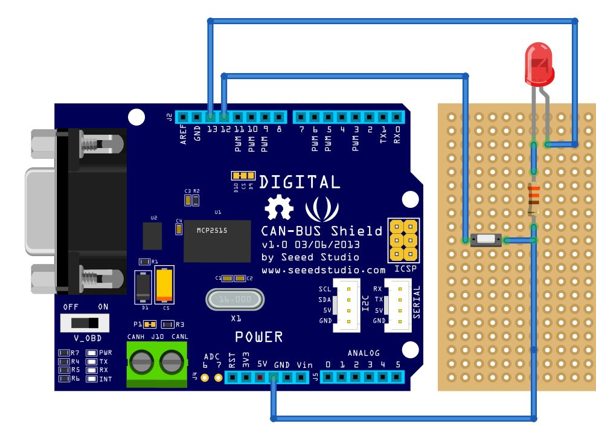
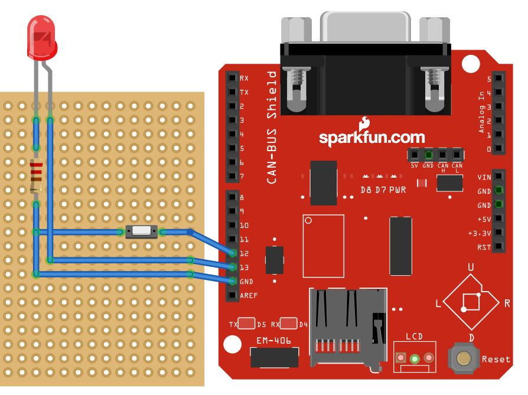

# VSCP L1 arduino library <!-- omit in toc -->

[](http://choosealicense.com/licenses/mit/)
[](https://www.repostatus.org/#active)
[](https://github.com/BlueAndi/vscp-arduino/releases)

- [VSCP](#vscp)
- [Library](#library)
- [How to send a VSCP event (raw)?](#how-to-send-a-vscp-event-raw)
  - [Define a transmit message](#define-a-transmit-message)
  - [Prepare the transmit message](#prepare-the-transmit-message)
  - [Add the class and type specific data](#add-the-class-and-type-specific-data)
  - [Send the event](#send-the-event)
- [How to send a VSCP event (abstract)?](#how-to-send-a-vscp-event-abstract)
  - [Include the abstract event module](#include-the-abstract-event-module)
  - [Call the event function](#call-the-event-function)
- [MDF](#mdf)
- [Decision Matrix](#decision-matrix)
- [Examples](#examples)
  - [Generic](#generic)
  - [Seeed-Studio CAN BUS Shield](#seeed-studio-can-bus-shield)
  - [Sparkfun CAN-BUS Shield](#sparkfun-can-bus-shield)
- [FAQ](#faq)
  - [How to install it?](#how-to-install-it)
  - [How to use the VSCP-framework in the code?](#how-to-use-the-vscp-framework-in-the-code)
  - [Where to find all the VSCP class defines and their corresponding types?](#where-to-find-all-the-vscp-class-defines-and-their-corresponding-types)
  - [Does the library only support the CAN-bus as transport protocotol?](#does-the-library-only-support-the-can-bus-as-transport-protocotol)
- [Issues, Ideas and bugs](#issues-ideas-and-bugs)
- [License](#license)
- [Contribution](#contribution)

## VSCP


The Very Simple Control Protocol (VSCP), an open and free protocol for IoT/m2m automation tasks.

More information can be found on the main site [http://www.vscp.org](http://www.vscp.org).

## Library

This is a arduino library of the VSCP software framework for level 1 devices.
It provides several layers according to the [VSCP specification](https://docs.vscp.org/spec/latest).

Recommended is to connect a LED, which shows the node state.

Mandatory is to connect a push button, used to start the node nickname discovery. Similar as shown in the Seeed-Studio CAN-BUS Shield example.

## How to send a VSCP event (raw)?

### Define a transmit message

```cpp
vscp_TxMessage  txMsg;
```

### Prepare the transmit message

That means to add the node nickname, the hardcoded flag, the class, the type and the priority.

```cpp
vscp.prepareTxMessage(txMsg, VSCP_CLASS_L1_INFORMATION, VSCP_TYPE_INFORMATION_ON, VSCP_PRIORITY_3_NORMAL);
```

### Add the class and type specific data

```cpp
txMsg.data[0]   = 1;  // Index
txMsg.data[1]   = 0;  // Zone
txMsg.data[2]   = 0;  // Sub zone
txMsg.dataSize  = 3;
```

### Send the event

```cpp
vscp.write(txMsg);
```

## How to send a VSCP event (abstract)?

### Include the abstract event module

```cpp
#include "framework/events/vscp_evt_information.h"
```

Take a look to the folder "framework/events/" to see all supported vscp event types.

### Call the event function

```cpp
// Index   : 1
// Zone    : 0
// Sub zone: 0
vscp_information_sendOnEvent(1, 0, 0);
```

No bytewise data assignment is necessary and complete done in the corresponding abstract event function. This way its more failure safe and reliable.

## MDF

You will find a template for the module description file here: [https://github.com/BlueAndi/vscp-arduino/blob/main/mdf_template.xml](https://github.com/BlueAndi/vscp-arduino/blob/main/mdf_template.xml)

How to use it, please take a look to the [VSCP specification](https://grodansparadis.gitbooks.io/the-vscp-specification/vscp_module_description_file.html).

## Decision Matrix

By default the decision matrix is enabled at page 1, offset 0 and provides about 10 rows.
If you need more rows, please change them in the

```plain
vscp_config_overwrite.h
```

by defining

```cpp
#define VSCP_CONFIG_DM_ROWS 20
```

with the number of rows at the end.

## Examples

### Generic

The generic example shows the basic integration of the VSCP arduino library.

### Seeed-Studio CAN BUS Shield

This example assume that the CAN BUS Shield from Seeed-Studio is used, as well as the corresponding CAN controller library.

- Shield: [http://wiki.seeedstudio.com/CAN-BUS_Shield_V1.2/](http://wiki.seeedstudio.com/CAN-BUS_Shield_V1.2/)
- Library: [https://github.com/Seeed-Studio/CAN_BUS_Shield](https://github.com/Seeed-Studio/CAN_BUS_Shield)



Notes:

- If you use the CAN terminal instead of the sub-d, don't forget to wire GND too! It may work over a short distance, but no guarantee.

### Sparkfun CAN-BUS Shield

This example assume that the CAN-BUS Shield from Sparkfun is used.
Because they provide no arduino library, the MCP2515 library from Frank Kienast is used.

- Shield: [https://www.sparkfun.com/products/10039](https://www.sparkfun.com/products/10039)
- Library: [https://github.com/franksmicro/Arduino/tree/main/libraries/MCP2515](https://github.com/franksmicro/Arduino/tree/main/libraries/MCP2515)



## FAQ

### How to install it?

Use the Arduino library manager for instalation. Instruction can be found here: [https://www.arduino.cc/en/Guide/Libraries#toc3](https://www.arduino.cc/en/Guide/Libraries#toc3)

### How to use the VSCP-framework in the code?

Please take a look to the provided examples because they guide you through all necessary things like

- Create a VSCP instance ```VSCP vscp;```.
- Calling the setup() method with some important parameters.
- And etc.

### Where to find all the VSCP class defines and their corresponding types?

You will find the class defines here:

```plain
src/framework/core/vscp_class_l1.h
src/framework/core/vscp_class_l1_l2.h
```

You will find the type defines here:

```plain
src/framework/events/vscp_evt_alarm.h
src/framework/events/vscp_evt_aol.h
src/framework/events/vscp_evt_configuration.h
src/framework/events/vscp_evt_control.h
src/framework/events/vscp_evt_data.h
src/framework/events/vscp_evt_diagnostic.h
src/framework/events/vscp_evt_display.h
src/framework/events/vscp_evt_error.h
src/framework/events/vscp_evt_gnss.h
src/framework/events/vscp_evt_information.h
src/framework/events/vscp_evt_ir.h
src/framework/events/vscp_evt_log.h
src/framework/events/vscp_evt_measurement.h
src/framework/events/vscp_evt_measurement32.h
src/framework/events/vscp_evt_measurement64.h
src/framework/events/vscp_evt_measurezone.h
src/framework/events/vscp_evt_multimedia.h
src/framework/events/vscp_evt_phone.h
src/framework/events/vscp_evt_protocol.h
src/framework/events/vscp_evt_security.h
src/framework/events/vscp_evt_setvaluezone.h
src/framework/events/vscp_evt_weather.h
src/framework/events/vscp_evt_weather_forecast.h
src/framework/events/vscp_evt_wireless.h
```

### Does the library only support the CAN-bus as transport protocotol?

No, the library is not limited to the CAN-bus protocol. It might look like, because of the examples above.
But that's because I only use the CAN-bus as transport protocol at home and I don't have e. g. a RS-485 shield.

Therefore the library supports the silent node behaviour too, which is used for non-multimaster protocols.
Enable it in the configuration src/framework/vscp_config_overwrite.h via

```cpp
#define VSCP_CONFIG_SILENT_NODE VSCP_CONFIG_BASE_ENABLED
```

## Issues, Ideas and bugs

If you have further ideas or you found some bugs, great! Create a [issue](https://github.com/BlueAndi/vscp-arduino/issues) or if
you are able and willing to fix it by yourself, clone the repository and create a pull request.

## License

The whole source code is published under the [MIT license](http://choosealicense.com/licenses/mit/).

## Contribution

Unless you explicitly state otherwise, any contribution intentionally submitted for inclusion in the work by you, shall be licensed as above, without any
additional terms or conditions.
