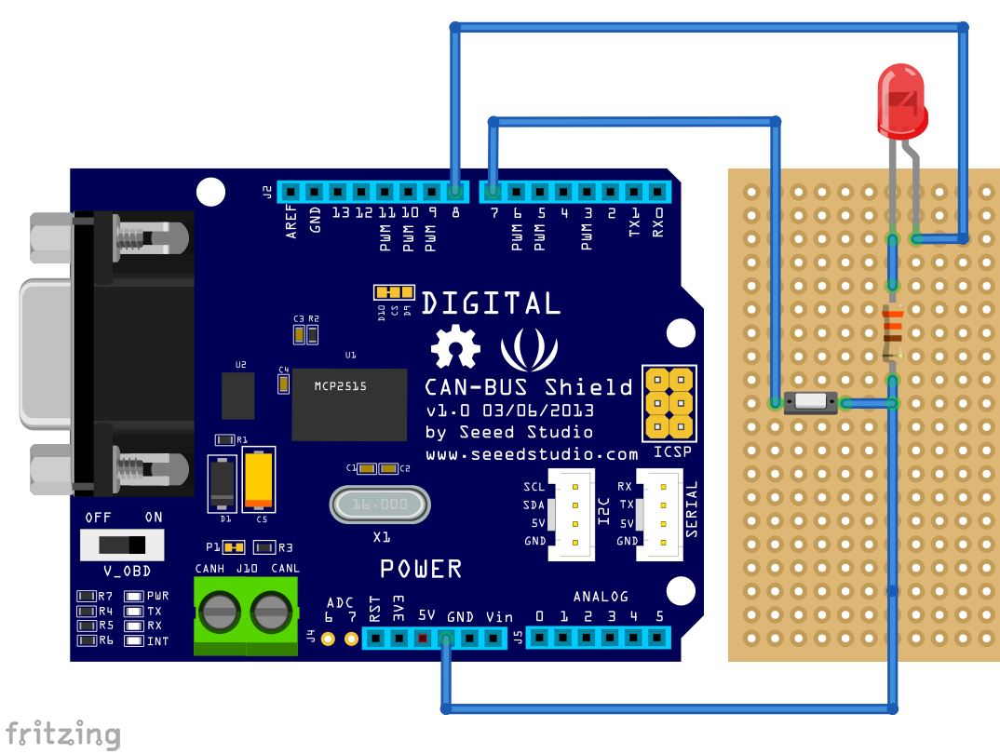
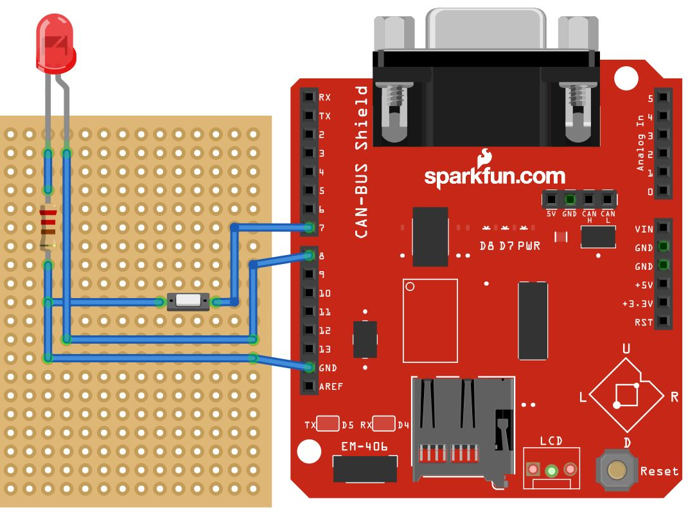

# VSCP L1 arduino library

[](http://choosealicense.com/licenses/mit/)
[](https://github.com/BlueAndi/vscp-arduino/releases)

1. [VSCP](https://github.com/BlueAndi/vscp-arduino#vscp)
2. [Library](https://github.com/BlueAndi/vscp-arduino#library)
3. [How to send a VSCP event (raw)?](https://github.com/BlueAndi/vscp-arduino#how-to-send-a-vscp-event-raw)
4. [How to send a VSCP event (abstract)?](https://github.com/BlueAndi/vscp-arduino#how-to-send-a-vscp-event-abstract)
5. [MDF](https://github.com/BlueAndi/vscp-arduino#mdf)
6. [Decision Matrix](https://github.com/BlueAndi/vscp-arduino#decision-matrix)
7. [Examples](https://github.com/BlueAndi/vscp-arduino#examples)
8. [FAQ](https://github.com/BlueAndi/vscp-arduino#faq)
9. [Issues, Ideas and bugs](https://github.com/BlueAndi/vscp-arduino#issues-ideas-and-bugs)
10. [License](https://github.com/BlueAndi/vscp-arduino#license)

## VSCP


The Very Simple Control Protocol (VSCP), an open and free protocol for IoT/m2m automation tasks.

More information can be found on the main site http://www.vscp.org

## Library
This is a arduino library of the VSCP software framework for level 1 devices.
It provides several layers according to the [VSCP specification](https://grodansparadis.gitbooks.io/the-vscp-specification/).

Recommended is to connect a LED, which shows the node state.

Mandatory is to connect a push button, used to start the node nickname discovery. Similar as shown in the Seeed-Studio CAN-BUS Shield example.

## How to send a VSCP event (raw)?

### Define a transmit message

```
vscp_TxMessage  txMsg;
```

### Prepare the transmit message
That means to add the node nickname, the hardcoded flag, the class, the type and the priority.

```
vscp.prepareTxMessage(txMsg, VSCP_CLASS_L1_INFORMATION, VSCP_TYPE_INFORMATION_ON, VSCP_PRIORITY_3_NORMAL);
```

### Add the class and type specific data.

```
txMsg.data[0] = 1;  // Index
txMsg.data[1] = 0;  // Zone
txMsg.data[2] = 0;  // Sub zone
txMsg.dataNum = 3;
```

### Send the event.

```
vscp.write(txMsg);
```

## How to send a VSCP event (abstract)?

### Include the abstract event module

```
#include "framework/events/vscp_information.h"
```

Take a look to the folder "framework/events/" to see all supported vscp event types.

### Call the event function

```
// Index   : 1
// Zone    : 0
// Sub zone: 0
vscp_information_sendOnEvent(1, 0, 0);
```

No bytewise data assignment is necessary and complete done in the corresponding abstract event function. This way its more failure safe and reliable.

## MDF

You will find a template for the module description file here: https://github.com/BlueAndi/vscp-arduino/blob/master/mdf_template.xml


How to use it, please take a look to the [VSCP specification](https://grodansparadis.gitbooks.io/the-vscp-specification/vscp_module_description_file.html).

## Decision Matrix

By default the decision matrix is enabled at page 1, offset 0 and provides about 10 rows.
If you need more rows, please change them in the
```
vscp_config_overwrite.h
```
by defining
```
#define VSCP_CONFIG_DM_ROWS 20
```
with the number of rows at the end.

## Examples

### Generic

The generic example shows the basic integration of the VSCP arduino library.

### Seeed-Studio CAN BUS Shield

This example assume that the CAN BUS Shield from Seeed-Studio is used, as well as the corresponding CAN controller library.

- Shield: http://wiki.seeedstudio.com/CAN-BUS_Shield_V1.2/
- Library: https://github.com/Seeed-Studio/CAN_BUS_Shield



Notes:
- If you use the CAN terminal instead of the sub-d, don't forget to wire GND too! It may work over a short distance, but no guarantee.

### Sparkfun CAN-BUS Shield

This example assume that the CAN-BUS Shield from Sparkfun is used.
Because they provide no arduino library, the MCP2515 library from Frank Kienast is used.

- Shield: https://www.sparkfun.com/products/10039
- Library: https://github.com/franksmicro/Arduino/tree/master/libraries/MCP2515



## FAQ

### How to install it?

Use the Arduino library manager for instalation. Instruction can be found here: https://www.arduino.cc/en/Guide/Libraries#toc3

### How to use the VSCP-framework in the code?

Please take a look to the provided examples because they guide you through all necessary things like
- Create a VSCP instance ```VSCP vscp;```.
- Calling the setup() method with some important parameters.
- And etc.

### Where to find all the VSCP class defines and their corresponding types?

You will find the class defines here:
```
src/framework/vscp_class_l1.h
src/framework/vscp_class_l1_l2.h
```

You will find the type defines here:
```
src/framework/vscp_type_alarm.h
src/framework/vscp_type_control.h
src/framework/vscp_type_display.h
src/framework/vscp_type_information.h
src/framework/vscp_type_measurement.h
src/framework/vscp_type_measurezone.h
src/framework/vscp_type_phone.h
src/framework/vscp_type_protocol.h
src/framework/vscp_type_remote.h
src/framework/vscp_type_security.h
src/framework/vscp_type_weather.h
src/framework/vscp_type_weather_forecast.h
```

### Does the library only support the CAN-bus as transport protocotol?

No, the library is not limited to the CAN-bus protocol. It might look like, because of the examples above.
But that's because I only use the CAN-bus as transport protocol at home and I don't have e. g. a RS-485 shield.

Therefore the library supports the silent node behaviour too, which is used for non-multimaster protocols.
Enable it in the configuration src/framework/vscp_config_overwrite.h via
```
#define VSCP_CONFIG_SILENT_NODE VSCP_CONFIG_BASE_ENABLED
```

## Issues, Ideas and bugs

If you have further ideas or you found some bugs, great! Create a [issue](https://github.com/BlueAndi/vscp-arduino/issues) or if
you are able and willing to fix it by yourself, clone the repository and create a pull request.

## License
The whole source code is published under the [MIT license](http://choosealicense.com/licenses/mit/).
